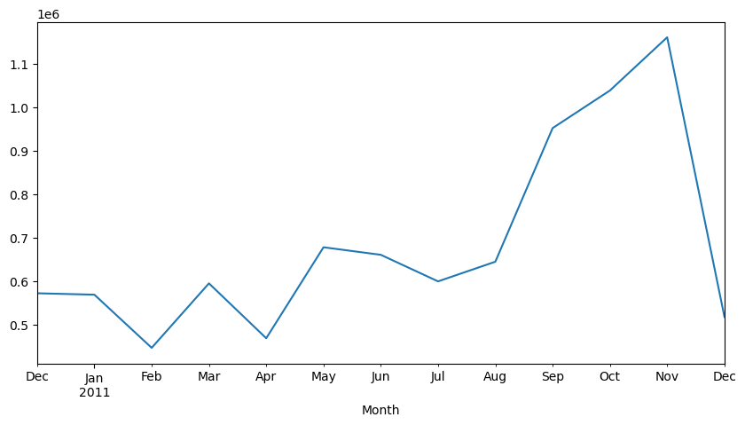
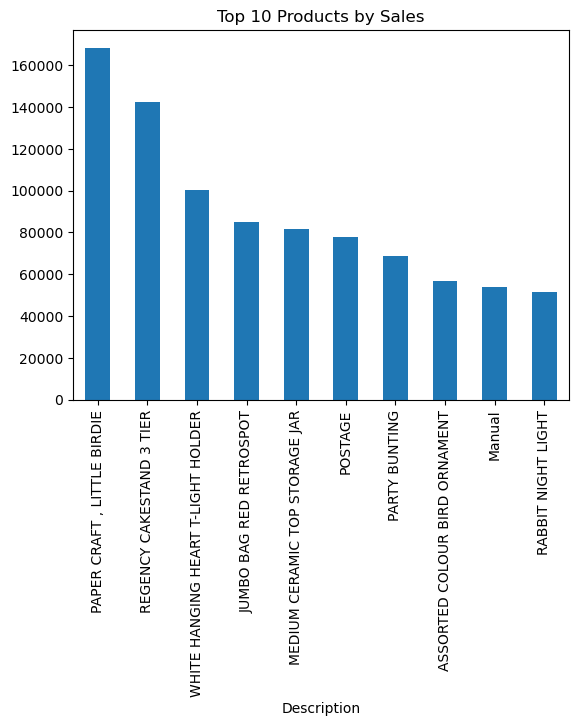
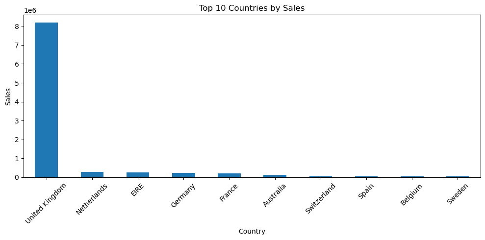
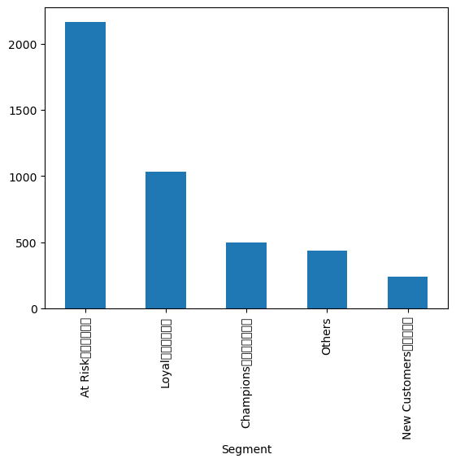
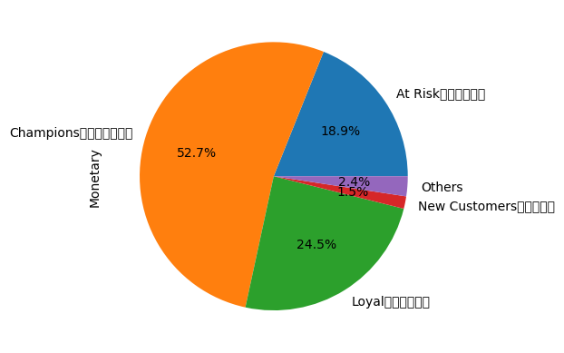

# E-commerce Sales Analysis

基于 Online Retail 电商交易数据的用户行为与销售分析项目。

本项目使用 Python 对英国在线零售企业交易数据进行清洗、探索性分析（EDA）以及 RFM 用户价值分析，挖掘销售趋势、核心商品、主要市场和客户分层特征，为运营决策提供数据支持。

---

## 1. Project Overview

### Dataset

数据来源：
Online Retail Dataset

数据规模：

- 541,909 条交易记录
- 8 个字段
- 时间范围：2010-12 至 2011-12

主要字段：

|字段|说明|
|-|-|
|InvoiceNo|订单编号|
|StockCode|商品编号|
|Description|商品名称|
|Quantity|购买数量|
|InvoiceDate|订单时间|
|UnitPrice|商品单价|
|CustomerID|客户编号|
|Country|国家|

---

# 2. Data Cleaning

主要处理步骤：

- 删除缺失 CustomerID 的记录
- 删除商品描述缺失数据
- 过滤 Quantity <= 0 的异常订单
- 过滤 UnitPrice <= 0 的异常价格
- 创建销售额指标：Sales = Quantity × UnitPrice

清洗后：

- 原始数据：541,909 条
- 有效交易：397,884 条

---

# 3. Exploratory Data Analysis

## 3.1 Sales Trend Analysis

分析月度销售变化：

发现：

- 2011 年 9-11 月销售额明显增长
- 11 月达到全年峰值
- 可能与节日消费、促销活动以及年底采购需求有关

---

## 3.2 Top Products Analysis

统计销售额最高的商品：

主要发现：

- PAPER CRAFT, LITTLE BIRDIE
- REGENCY CAKESTAND 3 TIER

等商品贡献较高收入。

---

## 3.3 Market Analysis

按国家统计销售额：

发现：

- United Kingdom 为主要市场
- 销售规模明显领先其他国家

---

# 4. Customer Segmentation (RFM Analysis)

基于 RFM 模型：

- Recency：最近一次消费时间
- Frequency：消费频率
- Monetary：消费金额

客户划分：

|客户类型|特点|
|-|-|
|Champions|高价值客户|
|Loyal|忠诚客户|
|New Customers|新客户|
|At Risk|流失风险客户|

结果：

- Champions 客户数量占比较低，但贡献超过 50% 收入
- At Risk 客户数量最多，需要重点召回

---

# 5. Tech Stack

Python

- Pandas
- NumPy
- Matplotlib
- Jupyter Notebook

数据分析方法：

- Data Cleaning
- Exploratory Data Analysis
- Groupby Aggregation
- RFM Customer Segmentation

---

# 6. Project Structure
├── data
├── images
├── notebook
├── requirements.txt
└── README.md

---

# 7. How to Run

Install dependencies:
pip install -r requirements.txt

Run notebook:
jupyter notebook

---

# 8. Key Findings

1. UK is the core market, contributing the majority of revenue.

2. Sales increased significantly from September to November 2011.

3. High-value customers generate more than half of total revenue, suggesting the importance of customer retention strategies.
